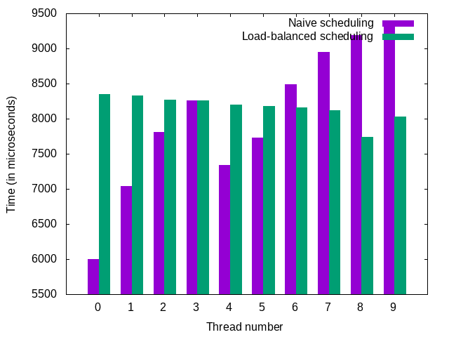

---
author:
- Navneel Singhal
title: '**COL331 Assignment 2**'
---

Description
===========

The task assigned for this assignment was to write a multithreaded
program that outputs all prime numbers upto some natural number $N$,
using $t$ threads, using the Sieve of Eratosthenes.

Running instructions
====================

The program is intended to be run using the following two ways.

1.  running `make` in the submission root directory -- this runs the
    program on $N = 10^6, t = 10$.

2.  running `make N=N_0 t=t_0` where $N_0, t_0$ are the values of $N$
    and $t$ that are required to be used for the program.

Outputs
=======

The outputs from the run on my system are in the directory
`output/local_outputs/`.\
The outputs that are generated from the algorithm are:

1.  The timing statistics -- these are stored in a text file called
    `timing_stats.txt` in the `output` directory.

2.  The primes generated as a result of running the algorithm -- this is
    stored in a text file called `primes.txt` in the `output` directory.

3.  The plot for the time taken for each thread (plotted as a clustered
    bar graph for each thread for both the approaches) -- this is shown
    at the end of the run, as well as stored in an image file called
    `timing_plot.png` in the `output` directory.

4.  The data file that is used by `gnuplot` to generate the plot -- this
    is stored in `stats_for_plotting.dat`.

Algorithm
=========

As per the specifications, there are two approaches. Both approaches use
the segmented Sieve of Eratosthenes, which is as described in the
Appendix.

Note that to avoid acquiring and releasing of mutexes too many times, we
break the whole partition into small chunks of size $c$. This has been
done uniformly across both approaches to ensure there is as less
difference in the implementation of both the approaches as possible, to
get the best results.

Naïve approach
--------------

In this approach, we statically divided the first $N$ natural numbers
into $t$ contiguous partitions, and ran the segmented sieve on each
partition on a thread of its own. In the implementation, this was done
by grouping together contiguous *chunks* (as described above), and
processing those chunks in order with minimal overhead, so that each
thread has roughly $\lfloor N/t \rfloor$ integers that it needs to
process.

Load-balanced approach
----------------------

In this approach, we bring in load balancing by invoking a function
called `allocate_chunk` that maintains an internal counter which keeps
track of the last chunk that was allocated to a thread, and allocates a
new chunk whenever it is called. The internal counter is the only data
location that is ever written to by more than one thread, so we use one
mutex that guards the call of this function in a thread. In other words,
exactly one thread can call this function at a time, so it is guaranteed
that the chunk number returned (and updated) by the function is indeed
the correct value, and that it isn't garbled by two threads trying to
change it at the same time.

Brief implementation details
============================

Algorithm details
-----------------

The high level description of the naïve algorithm is as follows:

1.  Precompute a sieve on the first $\sqrt{N}$ numbers.

2.  Divide the first $N$ natural numbers into chunks of size $c$.

3.  For each thread, run a function that takes the thread number, and
    using that, it takes a partition of the first $N$ natural numbers
    consisting of several chunks of size $c$, and generates primes for
    those chunks. Note that the primes are stored per chunk.

4.  Stitch together all these primes while outputting them.

The high level description of the load-balanced algorithm is as follows:

1.  Precompute a sieve on the first $\sqrt{N}$ numbers.

2.  Divide the first $N$ natural numbers into chunks of size $c$.

3.  For each thread, run a function that calls the chunk allocator and
    for each chunk, runs the algorithm on that chunk, and stops when the
    chunk allocator runs out of chunks to give.

4.  Stitch together all these primes while outputting them.

To reduce the memory requirements of the algorithm, I did some
optimizations as follows:

1.  Allocate $O(c)$ memory for each chunk's sieve, leading to a total of
    $O(tc)$ memory usage for the segmented sieve part.

2.  Allocate $O(\sqrt{n})$ memory for the precomputation sieve.

3.  Implement a vector library to ensure that the total memory allocated
    for storing primes remains linear in the number of primes (which is
    $O(N / \log N)$). The actual memory for storing is this plus
    $O(N/c)$, since I had a vector pointer for each chunk.

Measurements
------------

There were two measurements that were carried out:

1.  Wall clock time -- This represents the time difference between the
    instances in time when the thread started running and when it ended
    running.

2.  CPU thread time -- This represents the time taken by the thread
    actively on the CPU, and excludes sleep time.

The time that was actually used was CPU thread time, since it gives a
better measure of the time taken by a thread in actually processing the
data and hence is ideal for measuring the load imbalance among threads.

Parameters
==========

There were a few parameters that were used in the assignment.

1.  $N$: This was as given to us in the assignment $10^6$.

2.  $t$: This was the number of threads, as given to us in the
    assignment, with a default value of $10$.

3.  $c$: I experimented with chunk sizes in $\mathcal{O}(\sqrt{N})$,
    $\mathcal{O}(\sqrt[3]{N})$, and chunk sizes of various constant
    sizes. The most consistent results came from chunk sizes in
    $\mathcal{O}(\sqrt[3]{N})$, while for very large $N$
    ($N \sim 10^8 - 10^{10}$), better performance for the load balanced
    version comes from chunk sizes in $\mathcal{O}(\sqrt{N})$. This is
    because mutexes might be slow and consequently the bottleneck in the
    program.

4.  Small primes: We needed to precompute the primes not exceeding
    $\sqrt{N}$, so this gives rise to a fixed parameter corresponding to
    each $N$ which breaks the set of primes not exceeding $N$ into two
    sets -- "small\" and "big\".

Results
=======

The plot of time taken per thread is as follows.

From here, we note that there is a great deal of irregularity among the
time taken for various threads in the naïve implementation, however the
variation is quite low for the implementation that does load scheduling
of chunks.\
Some statistics from the set of primes obtained:

1.  There are 78498 primes below $10^6$.

2.  The largest prime not exceeding $10^6$ is $999983$.

Analysis
========

From the plots, it seems like there is load balancing in the second
approach, while there is no such balancing in the first approach. The
reason behind this observation is two-fold.

1.  There is no load balancing in the first approach, since we are
    statically assigning chunks to threads, without paying heed to the
    fact that some threads end executing before other threads, and that
    they stay idle for the remaining time.

2.  In the second approach, threads can ask the chunk allocator to
    allocate more chunks to them, and hence actively try to not stay
    idle (apart from the time when there is another thread asking the
    chunk allocator to allocate more chunks to it, where it needs to
    wait till the allocator can allocate a chunk to it). Since the chunk
    "computation\" sizes are relatively small (and the number of chunks
    is large), the result of such a competition between threads is in
    fact the threads doing roughly equal amounts of work (more
    precisely, if the computation time for a chunk is upper bounded by
    $T$ (and the allocation time is negligible compared to this), then
    there is no pair of threads whose end time differs by more than $T$.

Appendix -- Segmented Sieve of Eratosthenes
===========================================

The idea behind the segmented sieve of Eratosthenes is mainly the
following.\
Consider any natural number $n$. If it is composite, then $n = ab$ for
some $1 < a \le b < n$, with $a, b \in \mathbb{N}$. Hence we have
$a \le \sqrt{N}$. Hence, if we precompute all primes from $1$ to
$\sqrt{N}$, then we will only need to check all numbers from $1$ to $n$
for being divisible by a prime in this set.\
We proceed to the present a modification of the sieve of Eratosthenes,
where we consider numbers in a range $[l, r]$. In the simple sieve of
Eratosthenes, a prime $p \le
\lfloor\sqrt{N}\rfloor$ strikes out the numbers
$p^2, p^2 + p, \ldots, p\lfloor\frac{N}{p}\rfloor$. Hence in this range,
it will strike out the numbers in the intersection of this set with
$[l, r]$. When the sum is taken over the union of all such ranges, the
number of steps taken is the same as number of steps taken in the sieve
of Eratosthenes (apart from a few book-keeping steps to find the
starting point etc.). This forms the basis of the segmented sieve of
Eratosthenes. The number of steps taken in processing one chunk $[l, r]$
is upper bounded by $r - l + 1$ times the sum of reciprocals of primes
$\le \sqrt{N}$, which using the prime number theorem is in
$O((r - l + 1) \cdot \log \log n)$.
